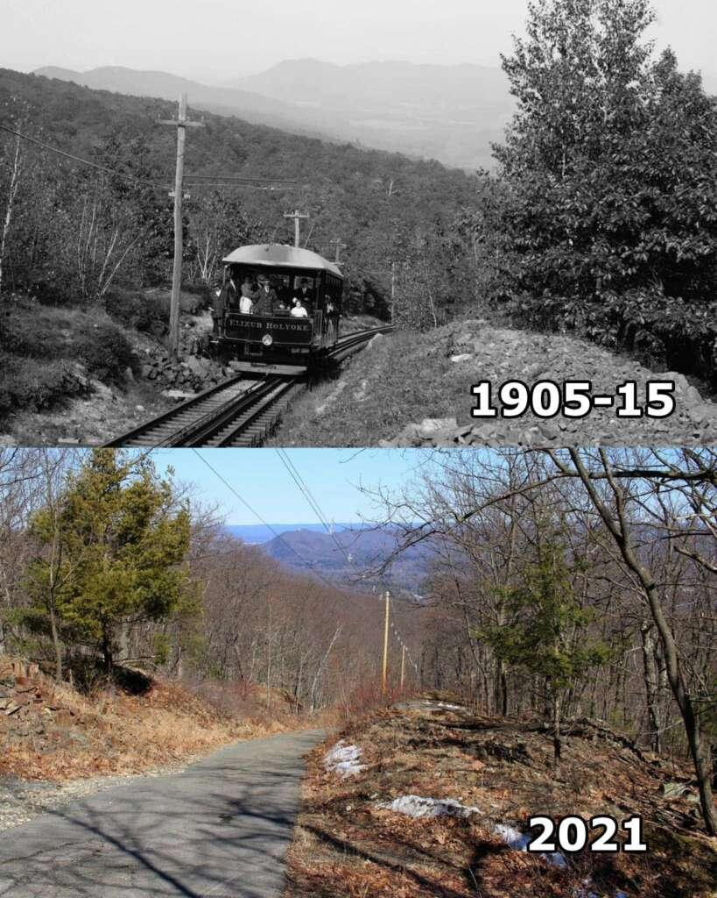
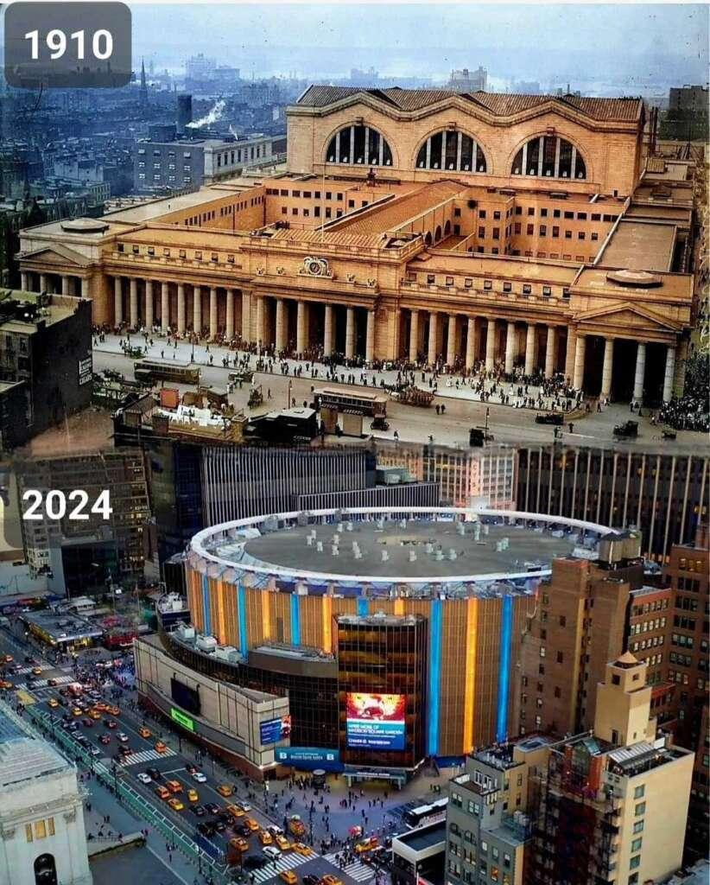
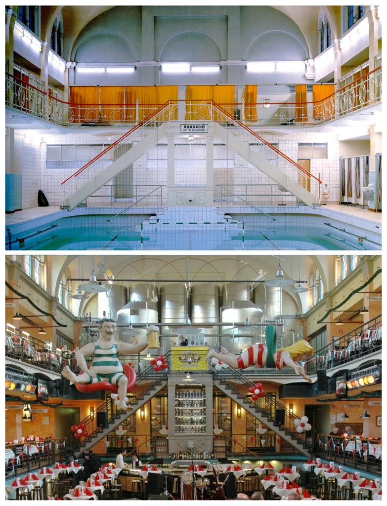

# time_machine
worldLab_2026

## Description
This project extracts and processes "Then vs Now" image datasets from web articles, downloads images, geocodes locations, and splits images into past and current views.

## Setup
1. Install uv: `curl -LsSf https://astral.sh/uv/install.sh | sh`
2. Create virtual environment: `uv venv`
3. Activate and install dependencies: `source .venv/bin/activate && uv pip install requests beautifulsoup4 pillow geopy`

## Usage
1. Place the web page content in `dataset_assets/data/page_content.txt`
2. Run the parser: `cd dataset_assets/scripts && python parse_data.py`
3. Download images: `python downloader.py`
4. Split images: `python splitter.py`

## Dataset Structure
The processed dataset is stored in `dataset_assets/data/dataset.json` with the following format:
- `title`: Section title
- `location`: Extracted location
- `date`: Year
- `image_url`: URL of the image
- `description`: Text description
- `geolocation`: Latitude, longitude, and address (if available)

Split images are saved in `dataset_assets/images/` and `dataset_assets/split_images/`.

## Sample Images
Here are some examples from the dataset:

